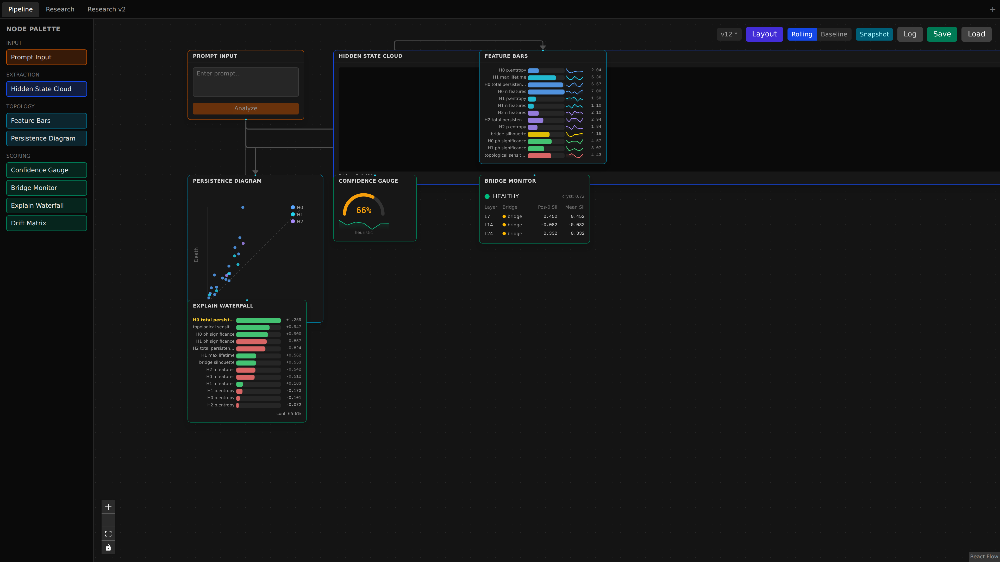
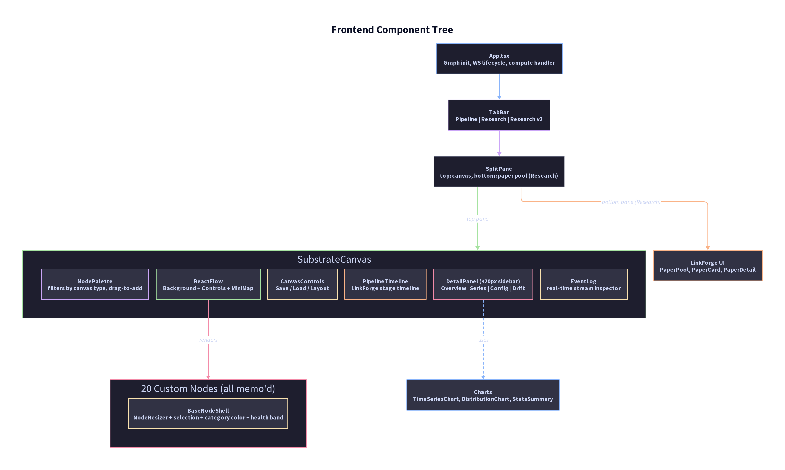
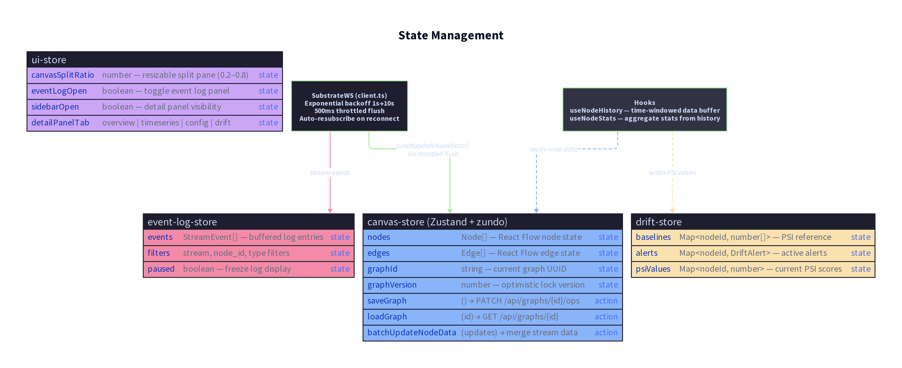
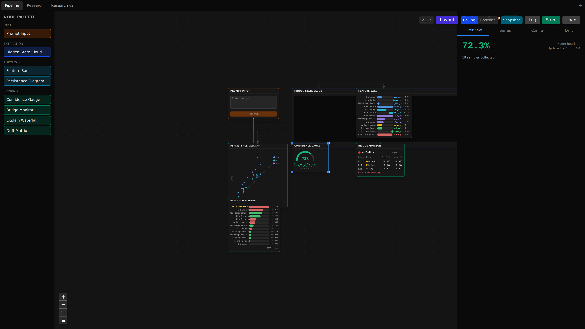
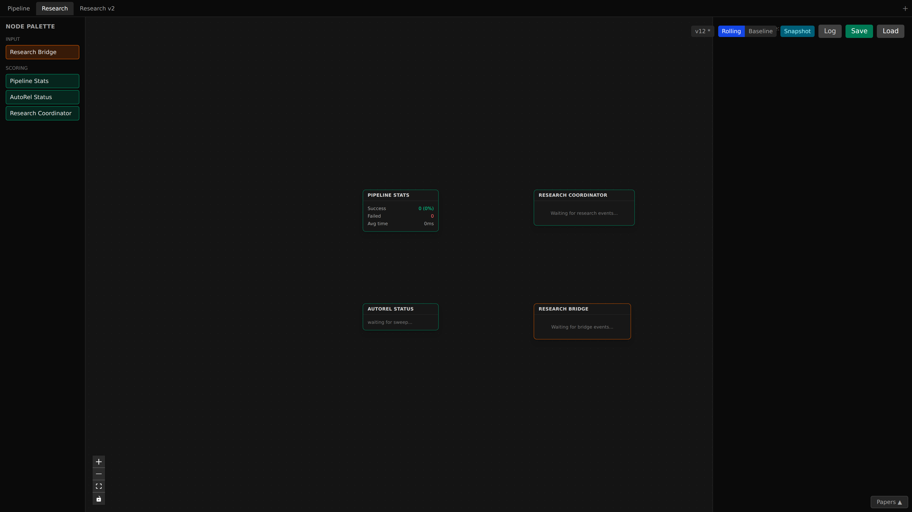
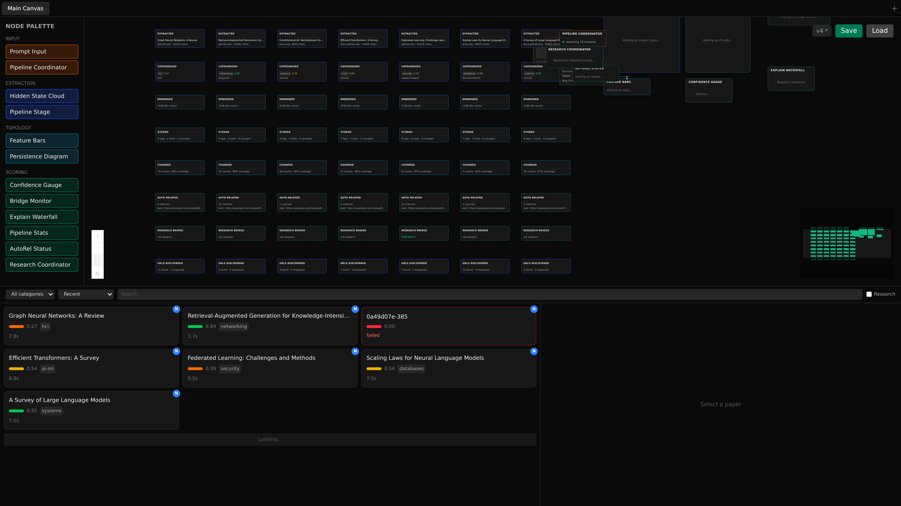
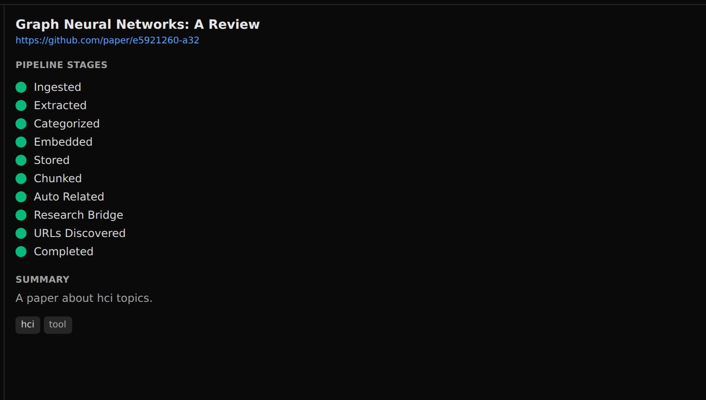
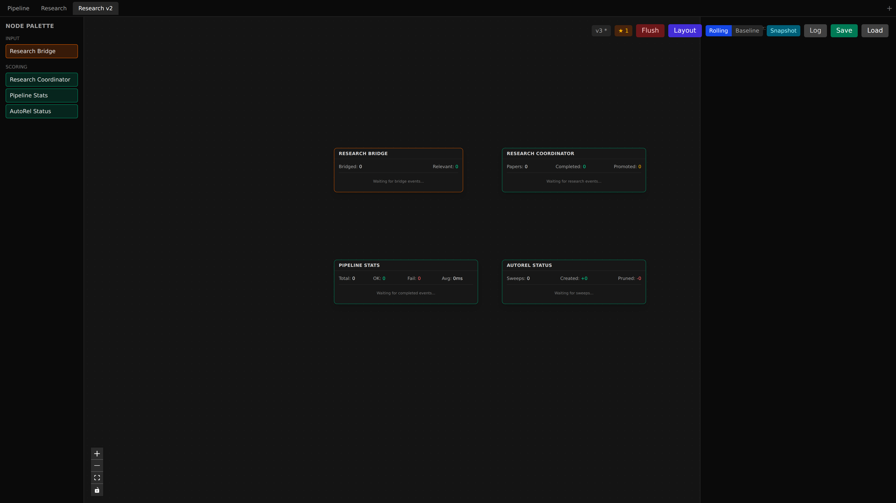

# node-graph-substrate

React Flow canvas + FastAPI + Redis Streams + PostgreSQL for real-time topo-confidence observability. Twenty node types across three canvas types (Pipeline, Research, Research v2) subscribe to 23 Redis streams and update live as each stage completes. Includes resizable nodes, detail panels with time-series and drift detection, and a visual test suite.

The substrate server **never imports topo-confidence**. All communication happens via Redis Streams. The topo-confidence adapter runs in a separate daemon container.

---

## System Architecture


Three Docker Compose services (plus an opt-in daemon). Frontend runs natively in WSL2 to avoid Docker volume-mount I/O thrashing:

| Service | Port | Stack | Runtime |
|---------|------|-------|---------|
| **Frontend** | 5173 | Vite + React 19 + React Flow v12 + Zustand + R3F | Native (WSL2) |
| **Server** | 8080 | FastAPI + uvicorn + asyncpg + redis-py | Docker |
| **PostgreSQL** | 5434 | postgres:16-alpine | Docker |
| **Redis** | 6381 | redis:7-alpine | Docker |
| **TopoConf Daemon** | — | topo-confidence wrapper (opt-in `--profile topoconf`) | Docker |

Three canvas types: **Pipeline** (topo-confidence scoring), **Research** (link-forge paper ingestion waterfall), **Research v2** (R2 nodes with paper starring).

---

## Quick Start

```bash
# PREFERRED — unified pipeline script starts NGS alongside link-forge + research-graph + autopilot:
bash ~/start-research-pipeline.sh
bash ~/start-research-pipeline.sh --status     # check what's running

# MANUAL — NGS only:
docker compose up                # postgres, redis, fastapi
cd frontend && npm run dev       # vite (native — not in Docker on WSL2)

# With real topo-confidence daemon (needs GPU + model cache)
docker compose --profile topoconf up

# Synthetic test data (no GPU needed)
python synthetic_daemon.py       # topoconf scoring streams
python synthetic_linkforge.py    # linkforge ingestion streams
```

Open `http://localhost:5173`. Per-canvas nodes are seeded on first visit (Pipeline: 7, Research: 4, R2: 5).

---

## Multi-Canvas Architecture

Three canvas types share a single graph + WebSocket connection but display different node sets:

| Canvas | Tab Name | Seeded Nodes | Stream Source |
|--------|----------|-------------|---------------|
| Pipeline | Pipeline | 7 scoring nodes | topoconf:scoring:* (6 streams) |
| Research | Research | 4 linkforge nodes | linkforge:* (10 streams + autorel) |
| Research v2 | Research v2 | 5 R2 nodes | topoconf:research:* (5 streams) |

**TabBar** switches between canvases. **NodePalette** filters available node types per canvas. Each canvas type has its own seeding logic.



---

## Database Schema


Six tables with cascade deletes ensuring referential integrity:

- **projects** — top-level container (unique slug)
- **graphs** — canvas instances with optimistic version counter
- **graph_versions** — JSONB snapshots for every save operation
- **nodes** — position, type, dimensions (text PKs for client-generated IDs)
- **node_configs** — JSONB config per node (separated for frequent updates)
- **edges** — source/target with handle metadata, FK cascade on node delete

Migrations are auto-applied on server startup from `migrations/`. Each migration runs inside an explicit transaction with its `_migrations` row insert.

---

## WebSocket Protocol


Single endpoint: `ws://host:8080/ws/canvas/{graph_id}`

### Client → Server

| Message | Purpose |
|---------|---------|
| `compute_request` | Trigger `component.build()` for a COMPUTED node |
| `config_update` | Update node config, persisted + broadcast |
| `resubscribe` | Re-register stream subscriptions (after reconnect) |

### Server → Client

| Message | Purpose |
|---------|---------|
| `graph_loaded` | Sent on connect — full graph state + manifests |
| `computation_result` | Response to compute_request (ok/error) |
| `stream_event` | Redis stream payload relayed to a subscriber node |
| `node_state_updated` | Config change broadcast to all canvas clients |
| `replay_gap` | Requested cursor predates earliest available entry |
| `error` | Parse errors, invalid requests |

All messages are JSON. Client messages are validated via Pydantic discriminated unions.

---

## Data Flow: Compute Path


The request/response loop for COMPUTED nodes (currently only PromptInput):

1. User types a prompt and clicks "Analyze"
2. `PromptInputNode` dispatches a `substrate:compute_request` CustomEvent
3. `App.tsx` sets node status to "computing" and sends via WebSocket
4. Server looks up (or dynamically instantiates) the component
5. `component.build()` executes — publishes to `topoconf:control` and returns features
6. Server sends `computation_result` with `ok: true`
7. Client updates node status to "idle" and fans out features to all FeatureBars nodes

Guard rails: subscriber nodes reject compute with `ok: false`; unknown nodes are instantiated from graph metadata (not client input); WS send failures immediately set error status.

---

## Data Flow: Subscriber Path


Three data source pipelines feed 23 Redis streams through a shared StreamHub:

| Pipeline | Source | Streams | Target Nodes |
|----------|--------|---------|-------------|
| **TopoConf Scoring** | Daemon / synthetic | 6 topoconf:scoring:* | hidden_state_cloud, persistence_diagram, feature_bars, confidence_gauge, bridge_monitor, explain_waterfall |
| **LinkForge Ingestion** | link-forge bot | 10 linkforge:* + autorel | lf_coordinator, lf_stats, lf_autorel, lf_stage, research_bridge |
| **Research Lifecycle** | research pipeline | 5 topoconf:research:* | research_coordinator |

The streaming path:

1. **Sources** publish to Redis streams via `XADD`
2. **StreamHub** maintains one `asyncio.Task` per stream doing `XREAD BLOCK 5000`
3. New entries fan out to all subscribed WebSockets (per-node addressing)
4. **SubstrateWS** client coalesces `stream_event` messages using 500ms throttled flushing
5. Batched updates go through `batchUpdateNodeData()` in the Zustand store
6. React Flow nodes re-render via `useNodesData(id)` (per-node subscription, not global)

This architecture handles high-frequency updates without frame drops — multiple stream events arriving within a 500ms window are merged into one store update.

---

## Frontend Components



### Component Hierarchy

- **App.tsx** — Graph initialization, WS lifecycle, compute event handler
- **TabBar** — Pipeline / Research / Research v2 canvas switcher
- **SplitPane** — Canvas (top) + PaperPool (bottom, Research canvas only)
- **SubstrateCanvas** — React Flow wrapper with:
  - **NodePalette** — Filters by canvas type, drag-to-add
  - **ReactFlow** — Background, Controls, MiniMap
  - **CanvasControls** — Save / Load / Layout
  - **PipelineTimeline** — LinkForge stage timeline
  - **DetailPanel** — 420px sidebar, 4 tabs (Overview, Series, Config, Drift)
  - **EventLog** — Real-time stream inspector
- **20 Custom Nodes** — All `memo()`'d, all wrap `BaseNodeShell`
- **Charts** — TimeSeriesChart, DistributionChart, StatsSummary

### State Management



| Store | Purpose |
|-------|---------|
| **canvas-store** (Zustand + zundo) | Nodes, edges, graph metadata, save/load, undo history (50 levels) |
| **ui-store** | Split pane ratio, event log open/closed, selected node ID |
| **drift-store** | PSI baselines, drift alerts, distribution snapshots |
| **event-log-store** | Stream event buffer, filters |

### Hooks

- **useNodeHistory** — Time-windowed data buffer per node
- **useNodeStats** — Aggregate statistics from node history

### WebSocket Client

**SubstrateWS** — Exponential backoff (1s→10s), 500ms throttled flushing, auto-resubscribe on reconnect.

---

## Detail Panel

Click any node to open a 420px sidebar with 4 tabs:

| Tab | Content |
|-----|---------|
| **Overview** | Node metadata, current values, health status |
| **Series** | TimeSeriesChart — scrolling time-windowed plot via useNodeHistory |
| **Config** | Node-specific config (sliders, toggles, text fields) |
| **Drift** | DistributionChart + PSI score — Population Stability Index vs baseline |



---

## Node Registry


Twenty node types across three canvases:

### Pipeline Canvas (8 nodes)

| Node | Category | Kind | Visualization | Subscribes To |
|------|----------|------|---------------|---------------|
| **Prompt Input** | input | COMPUTED | Textarea + button | — |
| **Hidden State Cloud** | extraction | SUBSCRIBER | R3F 3D point cloud | `hidden_state_cloud` |
| **Feature Bars** | topology | SUBSCRIBER | 13 horizontal bars (5 color groups) | `features_computed` |
| **Persistence Diagram** | topology | SUBSCRIBER | SVG birth-death scatter (H0/H1/H2) | `persistence_computed` |
| **Confidence Gauge** | scoring | SUBSCRIBER | SVG arc gauge (green/yellow/red) | `confidence_scored` |
| **Bridge Monitor** | scoring | SUBSCRIBER | Layer table + health badge | `bridge_health` |
| **Explain Waterfall** | scoring | SUBSCRIBER | 13-bar contribution waterfall | `explain_result` |
| **Drift Matrix** | scoring | SUBSCRIBER | PSI drift heatmap | — (local compute) |

### Research Canvas (7 node types)

| Node | Category | Kind | Visualization | Subscribes To |
|------|----------|------|---------------|---------------|
| **LF Coordinator** | coordination | SUBSCRIBER | Paper count + 10-stream status | `linkforge:*` (10 streams) |
| **LF Stage Card** | pipeline | dynamic | Per-paper stage cards | (created by coordinator) |
| **LF Stats** | metrics | SUBSCRIBER | Success/fail counts, avg time | `linkforge:completed` |
| **LF AutoRel** | metrics | SUBSCRIBER | Edge creation/pruning metrics | `linkforge:autorel:sweep_completed` |
| **Research Coordinator** | coordination | SUBSCRIBER | Triage → experiment → promote | `topoconf:research:*` (5 streams) |
| **Research Bridge** | coordination | SUBSCRIBER | Cross-pipeline bridge status | `linkforge:research_bridged` |
| **Pipeline Group** | container | — | Groups stage cards | — |

### Research v2 Canvas (5 nodes)

| Node | Category | Kind | Visualization | Subscribes To |
|------|----------|------|---------------|---------------|
| **R2 Bridge** | input | SUBSCRIBER | Bridge state | — |
| **R2 Coordinator** | coordination | SUBSCRIBER | Lifecycle coordination | — |
| **R2 Stats** | metrics | SUBSCRIBER | Aggregate statistics | — |
| **R2 AutoRel** | metrics | SUBSCRIBER | Auto-relation metrics | — |
| **R2 State** | state | SUBSCRIBER | Starred paper list | — |

All nodes use **BaseNodeShell** which provides NodeResizer handles, selection state, category color coding, and health status bands.

---

## Drift Detection

Nodes track value distributions over time via `useNodeHistory`. The drift system computes **Population Stability Index (PSI)** against a baseline distribution:

- **Green**: PSI < 0.1 — no significant drift
- **Yellow**: PSI 0.1–0.2 — moderate drift
- **Red**: PSI > 0.2 — significant drift (alert glow on node)

PSI computation lives in `frontend/src/lib/drift/psi.ts`. Baselines are stored in the drift-store and can be reset per-node.

---

## Resizable Nodes

All nodes support drag-to-resize via React Flow's `NodeResizer`. Dimensions are persisted to Postgres on save. **BaseNodeShell** renders blue resize handles on selection.

---

## Backend Component SDK


Components are Python classes extending `Component`:

```python
@registry.register
class MyComponent(Component):
    type_id = "my_type"
    kind = NodeKind.COMPUTED  # or SUBSCRIBER
    inputs = [Socket("in", SocketType.FEATURES, "Input")]
    outputs = [Socket("out", SocketType.CONFIDENCE, "Output")]
    subscribed_streams = []  # for SUBSCRIBER nodes

    async def build(self, **inputs):
        return {"result": compute(inputs)}
```

**COMPUTED** nodes implement `build()` — called via `compute_request`.
**SUBSCRIBER** nodes declare `subscribed_streams` — StreamHub auto-subscribes them on WS connect.

The `ComponentRegistry` handles registration, manifest generation, and instance creation. All 13 components self-register via `import substrate.components` at startup.

### Implementations (13)

| Component | Kind | Streams |
|-----------|------|---------|
| PromptInputComponent | COMPUTED | — |
| HiddenStateCloudComponent | SUBSCRIBER | `topoconf:scoring:hidden_state_cloud` |
| FeatureBarsComponent | SUBSCRIBER | `topoconf:scoring:features_computed` |
| PersistenceDiagramComponent | SUBSCRIBER | `topoconf:scoring:persistence_computed` |
| ConfidenceGaugeComponent | SUBSCRIBER | `topoconf:scoring:confidence_scored` |
| BridgeMonitorComponent | SUBSCRIBER | `topoconf:scoring:bridge_health` |
| ExplainWaterfallComponent | SUBSCRIBER | `topoconf:scoring:explain_result` |
| DriftMatrixComponent | SUBSCRIBER | — (local drift compute) |
| LfCoordinatorComponent | SUBSCRIBER | `linkforge:*` (10 streams) |
| LfStatsComponent | SUBSCRIBER | `linkforge:completed` |
| LfAutoRelComponent | SUBSCRIBER | `linkforge:autorel:sweep_completed` |
| ResearchBridgeComponent | SUBSCRIBER | `linkforge:research_bridged` |
| ResearchCoordinatorComponent | SUBSCRIBER | `topoconf:research:*` (5 streams) |

---

## Graph CRUD Lifecycle


### First Visit
1. Check URL `?graph=` param or localStorage cache
2. If neither, create default project + graph via HTTP
3. Seed per-canvas nodes (Pipeline: 7, Research: 4, R2: 5)
4. `saveGraph()` persists to Postgres

### Save Flow
1. Diff current node/edge IDs against server-tracked sets (`_serverNodeIds`, `_serverEdgeIds`)
2. Generate `remove_node`/`remove_edge` ops for deletions
3. Generate `upsert_node`/`upsert_edge` ops for everything current
4. `PATCH /api/graphs/{id}/ops` with `expected_version`
5. Server: `SELECT FOR UPDATE` → version check → apply ops → snapshot → bump version

### Version Conflicts
On 409: client receives `current_version` + full state, calls `loadGraph()` to re-sync.

---

## Redis Streams


### Control Channel (Server → Daemon)

| Stream | Payload | Size |
|--------|---------|------|
| `topoconf:control` | `{command, prompt, run_id}` | ~1 KB |

### TopoConf Scoring Streams (Daemon → Server) — 6 streams

| Stream | Payload | Size |
|--------|---------|------|
| `topoconf:scoring:hidden_state_cloud` | `{umap_3d (N x 3), clusters, bridge_idx}` | ~40 KB |
| `topoconf:scoring:persistence_computed` | `{H0, H1, H2 birth-death pairs}` | ~5 KB |
| `topoconf:scoring:features_computed` | `{features: {name: value} x 13}` | ~1 KB |
| `topoconf:scoring:confidence_scored` | `{confidence, mode}` | ~0.5 KB |
| `topoconf:scoring:bridge_health` | `{healthy, bridge_at_pos0, silhouette_by_layer}` | ~1 KB |
| `topoconf:scoring:explain_result` | `{features: {raw, scaled, coef, contrib}, top_contributor}` | ~2 KB |

### LinkForge Ingestion Streams — 10 streams

| Stream | Payload |
|--------|---------|
| `linkforge:ingested` | `{paper_id, url, title, source}` |
| `linkforge:extracted` | `{paper_id, abstract, authors, year}` |
| `linkforge:categorized` | `{paper_id, categories, relevance}` |
| `linkforge:embedded` | `{paper_id, vector_dim, model}` |
| `linkforge:stored` | `{paper_id, neo4j_id}` |
| `linkforge:chunked` | `{paper_id, chunk_count}` |
| `linkforge:auto_related` | `{paper_id, related_ids, scores}` |
| `linkforge:research_bridged` | `{paper_id, triage_candidate}` |
| `linkforge:url_discovered` | `{url, source, context}` |
| `linkforge:completed` | `{paper_id, duration_ms, stages_ok}` |

### LinkForge AutoRel — 1 stream

| Stream | Payload |
|--------|---------|
| `linkforge:autorel:sweep_completed` | `{sweep_id, papers_scored, new_relations, duration_ms}` |

### Research Lifecycle — 5 streams

| Stream | Payload |
|--------|---------|
| `topoconf:research:triaged` | `{paper_id, priority, rationale}` |
| `topoconf:research:script_generated` | `{paper_id, script_path}` |
| `topoconf:research:experiment_started` | `{paper_id, run_id, gpu}` |
| `topoconf:research:experiment_completed` | `{paper_id, run_id, metrics}` |
| `topoconf:research:promoted` | `{paper_id, target_pathway}` |

All 23 streams: `MAXLEN ~ 10000`, plain `XREAD` (not `XREADGROUP`) for broadcast semantics, max 256 KB payload assertion.

---

## Project Structure


```
node-graph-substrate/
├── docker-compose.yml
├── synthetic_daemon.py          # Fake topoconf scoring data
├── synthetic_linkforge.py       # Fake linkforge ingestion data
├── take_screenshots.py          # Playwright gallery capture
├── migrations/
│   ├── 001_init.sql
│   └── 002_schema_fixes.sql
├── server/substrate/
│   ├── main.py                  # FastAPI app, HTTP routes, WS handler
│   ├── db.py                    # asyncpg pool + migration runner
│   ├── crud.py                  # DB queries + optimistic locking
│   ├── ws.py                    # ConnectionManager (per-socket lock)
│   ├── streamhub.py             # Redis stream reader tasks + fan-out
│   ├── sdk.py                   # Component base class + Socket/NodeKind
│   ├── registry.py              # ComponentRegistry singleton
│   ├── schemas.py               # Pydantic HTTP models
│   ├── messages.py              # WS message discriminated unions
│   └── components/              # 13 registered components
│       ├── prompt_input.py      # COMPUTED
│       ├── feature_bars.py      # SUBSCRIBER
│       ├── hidden_state_cloud.py
│       ├── persistence_diagram.py
│       ├── confidence_gauge.py
│       ├── bridge_monitor.py
│       ├── explain_waterfall.py
│       ├── drift_matrix.py
│       ├── lf_coordinator.py
│       ├── lf_stats.py
│       ├── lf_autorel.py
│       ├── research_bridge.py
│       └── research_coordinator.py
├── frontend/src/
│   ├── App.tsx
│   ├── components/
│   │   ├── canvas/              # SubstrateCanvas, TabBar, SplitPane,
│   │   │                        # CanvasControls, PipelineTimeline, node-types
│   │   ├── nodes/               # 20 node components + BaseNodeShell + Sparkline
│   │   ├── panels/              # DetailPanel (420px, 4 tabs) + EventLog
│   │   ├── charts/              # TimeSeriesChart, DistributionChart, StatsSummary
│   │   ├── edges/               # edge-types, StaleEdge
│   │   └── linkforge/           # PaperCard, PaperDetail, PaperPool
│   ├── lib/
│   │   ├── ws/client.ts         # SubstrateWS (backoff + throttled flush)
│   │   ├── store/               # canvas-store, ui-store, drift-store, event-log-store
│   │   ├── hooks/               # useNodeHistory, useNodeStats
│   │   ├── drift/psi.ts         # Population Stability Index computation
│   │   └── layout/              # elk-layout, elk-worker
│   └── types/                   # nodes.ts, messages.ts
├── daemons/topoconf/
│   ├── adapter.py               # TopoBridge (7-stage pipeline)
│   └── topoconf_daemon.py       # XREAD control loop
└── tests/visual/
    ├── run_visual_tests.py      # 19 YAML specs, 3 canvas types
    └── specs/                   # Per-node test definitions
```

---

## WebSocket Lifecycle


### Connection Flow
1. `App.tsx` resolves `graphId` → creates `SubstrateWS(graphId)`
2. Enables throttled flushing, registers message handler, sets subscriptions
3. `ws.connect()` opens WebSocket to `/ws/canvas/{graphId}`
4. Server loads graph, sends `graph_loaded`, instantiates components, subscribes streams

### Reconnection
- Exponential backoff: 1s → 2s → 4s → 8s → 10s cap
- On reconnect: automatically sends `resubscribe` with all active subscriptions
- Server re-registers streams in StreamHub, resumes XREAD from last cursor
- Backoff resets to 1s on successful reconnect

### Cleanup
- Component unmount: `shouldReconnect = false`, `cancelAnimationFrame`, clear pending map
- Server side: `unsubscribe_all(ws)`, destroy components, remove from ConnectionManager

---

## Event Log

Real-time stream inspector that shows raw Redis stream events as they flow through the system. Toggle via the event-log-store. Useful for debugging stream connectivity and payload inspection.

---

## Visual Test Suite

19 YAML specs covering all 3 canvas types. Each spec defines a node to find, wait ticks, and optional detail panel interaction.

```bash
# Run all specs
python tests/visual/run_visual_tests.py

# Specific node, non-headless
python tests/visual/run_visual_tests.py --spec confidence_gauge --no-headless

# Custom timing
python tests/visual/run_visual_tests.py --duration 30 --interval 3 --wait-ticks 5
```

Latest run: 17/19 pass, 84 screenshots across 3 canvas types.

---

## Key Design Decisions

- **Substrate isolation**: Server never imports topo-confidence. `grep -r "topo_confidence" server/substrate/` = 0 lines.
- **Broadcast semantics**: Plain `XREAD` (not consumer groups) — every connected client sees every event.
- **Throttled flushing**: Multiple stream events within a 500ms window are merged before hitting React state.
- **Per-node subscriptions**: `useNodesData(id)` instead of `useNodes()` — only the affected node re-renders.
- **Optimistic concurrency**: `expected_version` on save prevents silent overwrites. 409 triggers full re-sync.
- **Server-side ID tracking**: Client tracks `_serverNodeIds`/`_serverEdgeIds` to compute remove ops on save.
- **R3F `frameloop="demand"`**: 3D point cloud only re-renders when data changes, not every animation frame.
- **BaseNodeShell pattern**: All 20 nodes wrap the same shell for consistent resize, selection, and health band behavior.

---

## Development

```bash
# TypeScript check
cd frontend && npx tsc --noEmit

# Server logs
docker compose logs -f server

# Redis stream inspection
redis-cli -p 6381 XLEN topoconf:scoring:features_computed
redis-cli -p 6381 XRANGE topoconf:scoring:features_computed - + COUNT 1
redis-cli -p 6381 XLEN linkforge:ingested

# Substrate isolation check
grep -r "topo_confidence\|TopoConfidence" server/substrate/

# Visual test suite
python tests/visual/run_visual_tests.py

# Screenshot gallery
python take_screenshots.py
```

---

## Screenshots

### Pipeline Canvas

All 7 scoring nodes pre-wired on first visit. Node Palette sidebar on the left filters by canvas type. Save/Load controls top-right.


### Live Streaming Data

Synthetic daemon publishing to 6 Redis Streams every 5s. All subscriber nodes update in real-time via WebSocket + throttled flushing.


### Compute Path — Prompt Analysis

User enters a prompt and clicks "Analyze". The compute request flows through WebSocket, all nodes update with new topological features.


### Individual Pipeline Nodes (with live data)

<table>
<tr>
<td width="50%">

**Hidden State Cloud** — R3F 3D point cloud of token embeddings. Blue = cluster 0, red = cluster 1, gold = bridge token. Bridge silhouette score shown below.


</td>
<td width="50%">

**Persistence Diagram** — Birth-death scatter for homology dimensions H0 (blue), H1 (cyan), H2 (purple). Points above the diagonal indicate persistent topological features.


</td>
</tr>
<tr>
<td>

**Feature Bars** — 13 topological features color-coded by dimension group (blue = H0, cyan = H1, purple = H2, gold = bridge, green/red = significance).


</td>
<td>

**Confidence Gauge** — SVG arc gauge showing heuristic or calibrated confidence score. Green ≥ 0.7, yellow ≥ 0.4, red < 0.4.


</td>
</tr>
<tr>
<td>

**Bridge Monitor** — Layer-by-layer bridge detection (L7/L14/L24) with health status and silhouette scores. Anomaly = bridge missing at any layer.


</td>
<td>

**Explain Waterfall** — Feature contribution waterfall showing which topological features drive the confidence score. Top contributor highlighted.


</td>
</tr>
</table>

### Research Canvas — Paper Digestion Pipeline

The Research canvas visualizes the [link-forge](https://github.com/musicofhel/link-forge) paper ingestion pipeline in real time. Papers flow through 10 stages (Ingested → Extracted → Categorized → Embedded → Stored → Chunked → Auto Related → Research Bridged → URLs Discovered → Completed), with each stage rendered as a React Flow node in a vertical waterfall.



### Paper Pool & Detail View

Click any paper card to see its full pipeline progress, summary, and research lifecycle status.

<table>
<tr>
<td width="50%">

**Paper Pool** — Cards with forge score bars, category badges, processing time. Sort by score/time/category, filter by category, search, or toggle research-only.



</td>
<td width="50%">

**Paper Detail** — Pipeline stage waterfall (green = complete, red = failed), summary, category/content-type badges, and research lifecycle for arxiv papers.



</td>
</tr>
</table>

### Research v2 Canvas

R2 nodes with paper starring and lifecycle coordination.



### Detail Panel

Click any node to open a 420px sidebar with 4 tabs:


