# node-graph-substrate

React Flow canvas + FastAPI + Redis Streams + PostgreSQL for real-time topo-confidence observability. Seven visualization nodes subscribe to a streaming ML scoring pipeline and update live as each stage completes.

The substrate server **never imports topo-confidence**. All communication happens via Redis Streams. The topo-confidence adapter runs in a separate daemon container.

---

## System Architecture

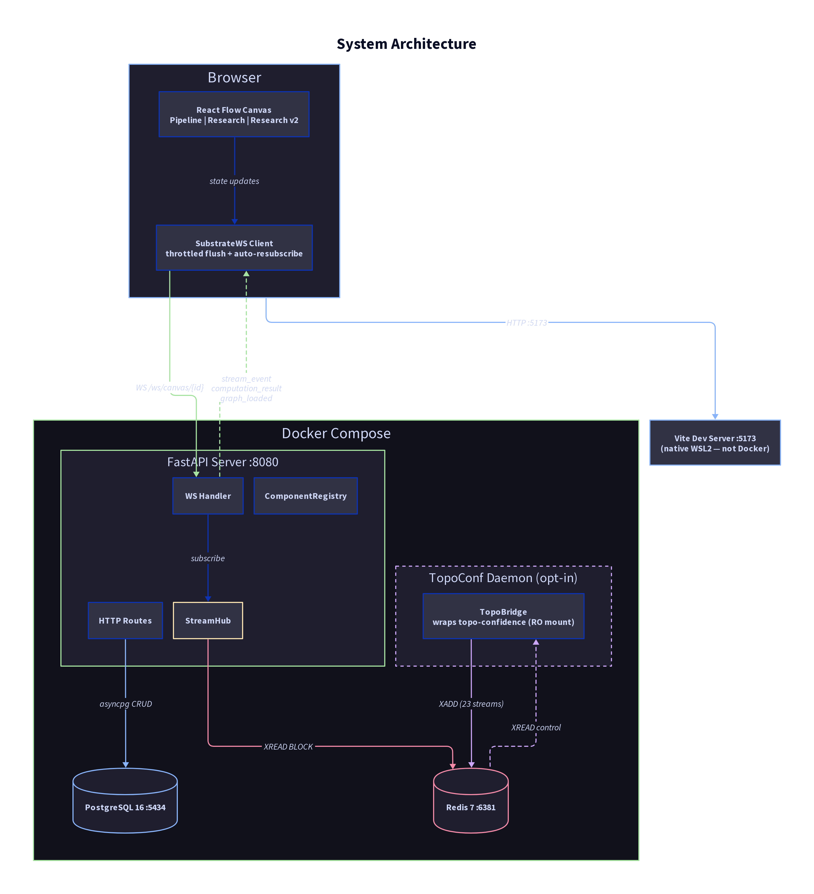

Four Docker Compose services (plus an opt-in daemon):

| Service | Port | Stack |
|---------|------|-------|
| **Frontend** | 5173 | Vite + React 19 + React Flow v12 + Zustand + R3F |
| **Server** | 8080 | FastAPI + uvicorn + asyncpg + redis-py |
| **PostgreSQL** | 5434 | postgres:16-alpine |
| **Redis** | 6381 | redis:7-alpine |
| **TopoConf Daemon** | — | topo-confidence wrapper (opt-in `--profile topoconf`) |

---

## Quick Start

```bash
# Start core services
docker compose up

# With real topo-confidence daemon (needs GPU + model cache)
docker compose --profile topoconf up

# Synthetic test data (no GPU needed)
python synthetic_daemon.py
```

Open `http://localhost:5173`. A default canvas with all 7 nodes pre-wired is created on first visit.

---

## Database Schema

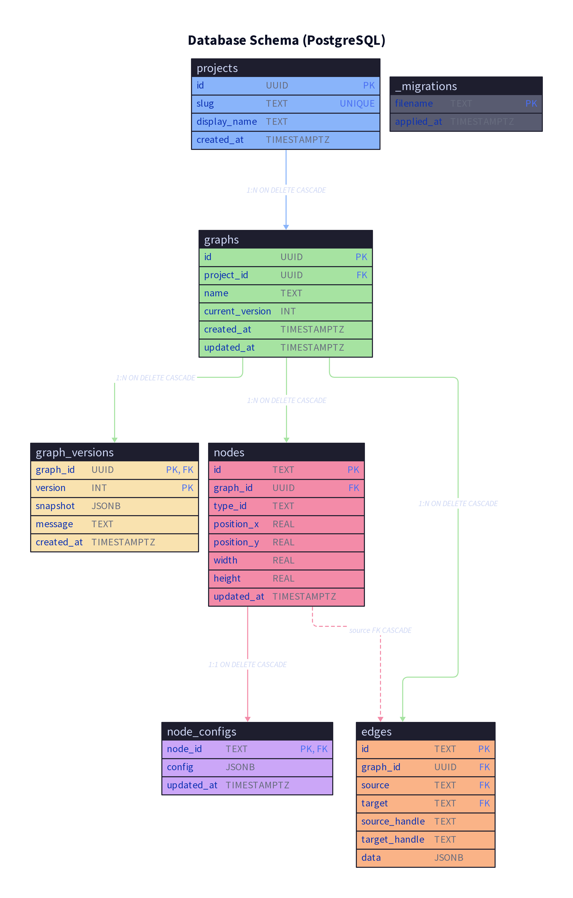

Six tables with cascade deletes ensuring referential integrity:

- **projects** — top-level container (unique slug)
- **graphs** — canvas instances with optimistic version counter
- **graph_versions** — JSONB snapshots for every save operation
- **nodes** — position, type, dimensions (text PKs for client-generated IDs)
- **node_configs** — JSONB config per node (separated for frequent updates)
- **edges** — source/target with handle metadata, FK cascade on node delete

Migrations are auto-applied on server startup from `migrations/`. Each migration runs inside an explicit transaction with its `_migrations` row insert.

---

## WebSocket Protocol

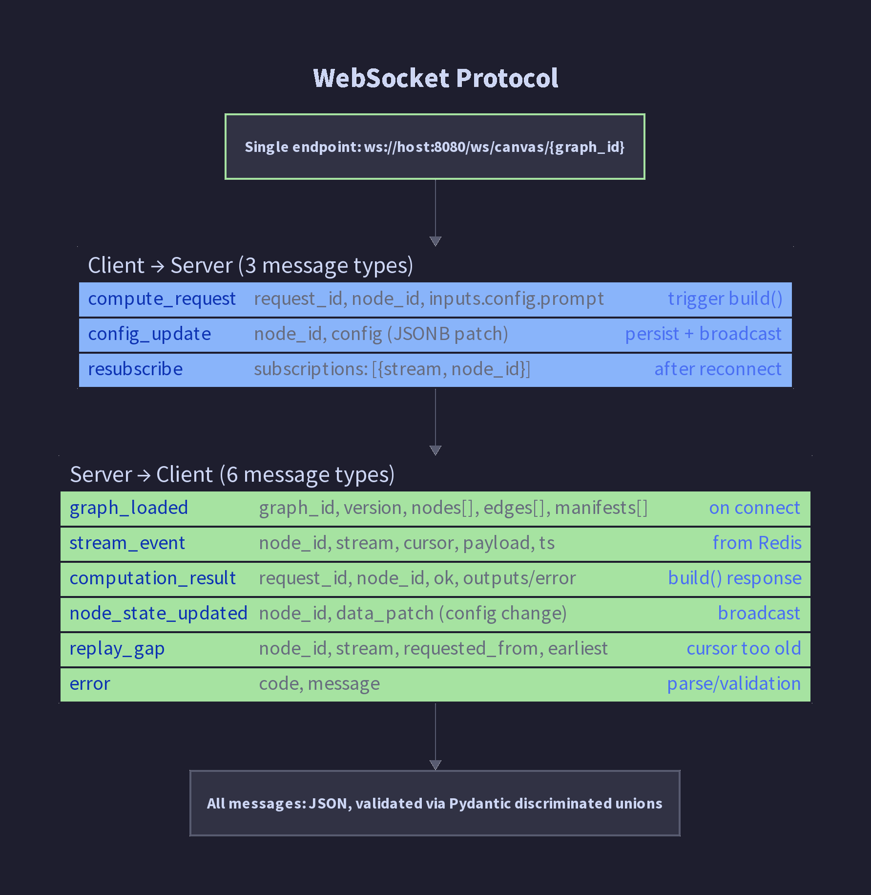

Single endpoint: `ws://host:8080/ws/canvas/{graph_id}`

### Client → Server

| Message | Purpose |
|---------|---------|
| `compute_request` | Trigger `component.build()` for a COMPUTED node |
| `config_update` | Update node config, persisted + broadcast |
| `resubscribe` | Re-register stream subscriptions (after reconnect) |

### Server → Client

| Message | Purpose |
|---------|---------|
| `graph_loaded` | Sent on connect — full graph state + manifests |
| `computation_result` | Response to compute_request (ok/error) |
| `stream_event` | Redis stream payload relayed to a subscriber node |
| `node_state_updated` | Config change broadcast to all canvas clients |
| `error` | Parse errors, invalid requests |

All messages are JSON. Client messages are validated via Pydantic discriminated unions.

---

## Data Flow: Compute Path

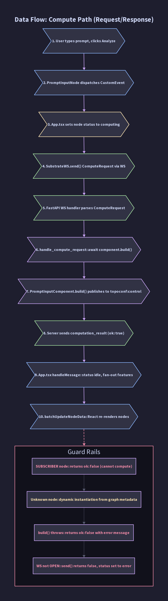

The request/response loop for COMPUTED nodes (currently only PromptInput):

1. User types a prompt and clicks "Analyze"
2. `PromptInputNode` dispatches a `substrate:compute_request` CustomEvent
3. `App.tsx` sets node status to "computing" and sends via WebSocket
4. Server looks up (or dynamically instantiates) the component
5. `component.build()` executes — publishes to `topoconf:control` and returns features
6. Server sends `computation_result` with `ok: true`
7. Client updates node status to "idle" and fans out features to all FeatureBars nodes

Guard rails: subscriber nodes reject compute with `ok: false`; unknown nodes are instantiated from graph metadata (not client input); WS send failures immediately set error status.

---

## Data Flow: Subscriber Path

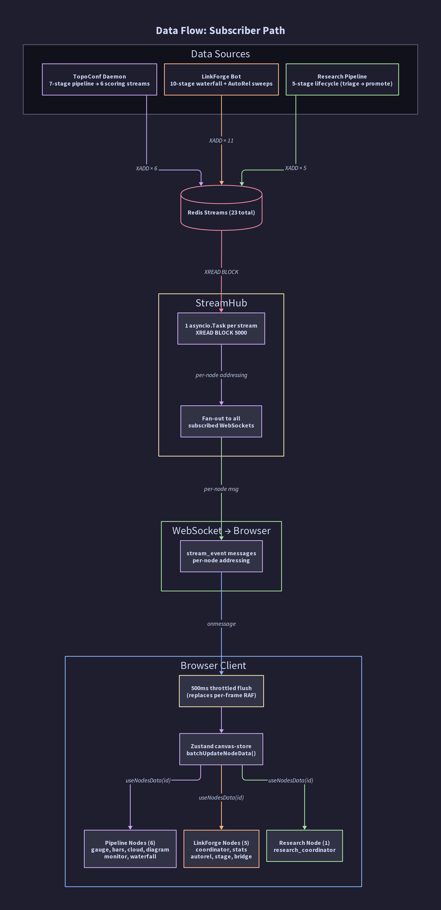

The streaming pipeline from daemon through to React nodes:

1. **Daemon** processes prompt through 7 stages, publishing to 6 Redis streams
2. **StreamHub** maintains one `asyncio.Task` per stream doing `XREAD BLOCK 5000`
3. New entries fan out to all subscribed WebSockets (per-node addressing)
4. **SubstrateWS** client coalesces `stream_event` messages using `requestAnimationFrame`
5. Batched updates go through `batchUpdateNodeData()` in the Zustand store
6. React Flow nodes re-render via `useNodesData(id)` (per-node subscription, not global)

This architecture handles high-frequency updates without frame drops — multiple stream events arriving within a single frame are merged into one store update.

---

## Frontend Components

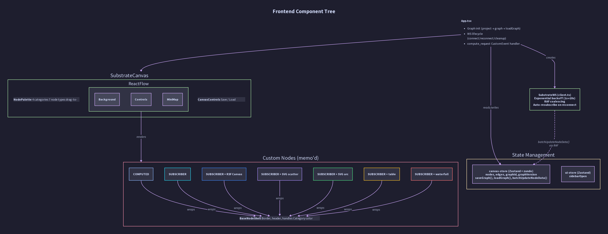

### Component Hierarchy

- **App.tsx** — Graph initialization, WS lifecycle, compute event handler
- **SubstrateCanvas** — React Flow wrapper with palette sidebar
  - **NodePalette** — 4 categories, 7 node types, drag-to-add
  - **ReactFlow** — Background, Controls, MiniMap
  - **CanvasControls** — Save/Load buttons
- **7 Custom Nodes** — All `memo()`'d, all wrap `BaseNodeShell`

### State Management

- **canvas-store** (Zustand + zundo) — nodes, edges, graph metadata, save/load, undo history (50 levels)
- **ui-store** (Zustand) — sidebar state
- **SubstrateWS** (class) — WS connection with exponential backoff and RAF coalescing

---

## Node Registry

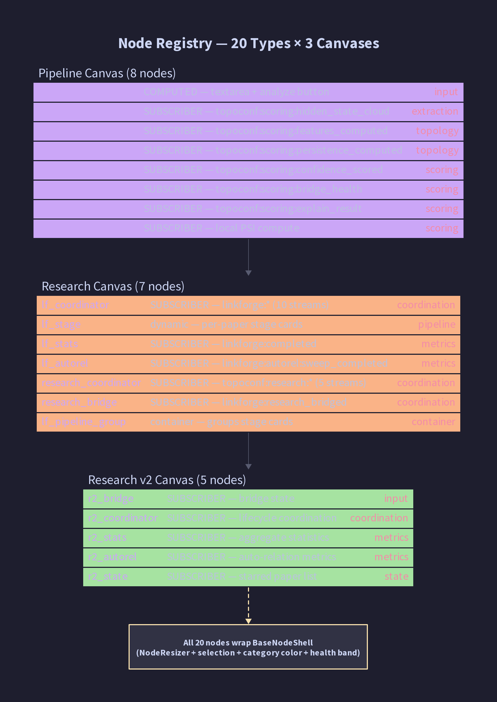

Seven node types across four categories:

| Node | Category | Kind | Visualization | Subscribes To |
|------|----------|------|---------------|---------------|
| **Prompt Input** | input | COMPUTED | Textarea + button | — |
| **Hidden State Cloud** | extraction | SUBSCRIBER | R3F 3D point cloud | `hidden_state_cloud` |
| **Feature Bars** | topology | SUBSCRIBER | 13 horizontal bars (5 color groups) | `features_computed` |
| **Persistence Diagram** | topology | SUBSCRIBER | SVG birth-death scatter (H0/H1/H2) | `persistence_computed` |
| **Confidence Gauge** | scoring | SUBSCRIBER | SVG arc gauge (green/yellow/red) | `confidence_scored` |
| **Bridge Monitor** | scoring | SUBSCRIBER | Layer table + health badge | `bridge_health` |
| **Explain Waterfall** | scoring | SUBSCRIBER | 13-bar contribution waterfall | `explain_result` |

Connection validation enforces handle type compatibility via `NODE_REGISTRY`.

---

## Backend Component SDK

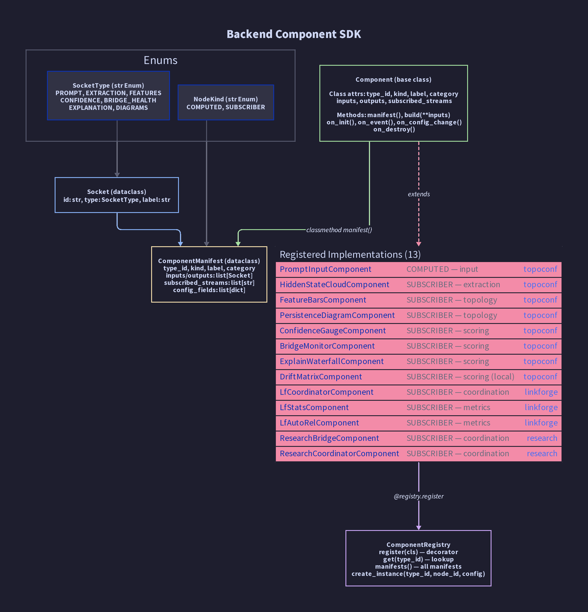

Components are Python classes extending `Component`:

```python
@registry.register
class MyComponent(Component):
    type_id = "my_type"
    kind = NodeKind.COMPUTED  # or SUBSCRIBER
    inputs = [Socket("in", SocketType.FEATURES, "Input")]
    outputs = [Socket("out", SocketType.CONFIDENCE, "Output")]
    subscribed_streams = []  # for SUBSCRIBER nodes

    async def build(self, **inputs):
        return {"result": compute(inputs)}
```

**COMPUTED** nodes implement `build()` — called via `compute_request`.
**SUBSCRIBER** nodes declare `subscribed_streams` — StreamHub auto-subscribes them on WS connect.

The `ComponentRegistry` handles registration, manifest generation, and instance creation. All 7 components self-register via `import substrate.components` at startup.

---

## Graph CRUD Lifecycle

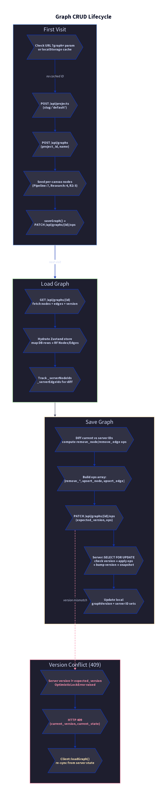

### First Visit
1. Check URL `?graph=` param or localStorage cache
2. If neither, create default project + graph via HTTP
3. Seed 7 default nodes + 6 edges
4. `saveGraph()` persists to Postgres

### Save Flow
1. Diff current node/edge IDs against server-tracked sets (`_serverNodeIds`, `_serverEdgeIds`)
2. Generate `remove_node`/`remove_edge` ops for deletions
3. Generate `upsert_node`/`upsert_edge` ops for everything current
4. `PATCH /api/graphs/{id}/ops` with `expected_version`
5. Server: `SELECT FOR UPDATE` → version check → apply ops → snapshot → bump version

### Version Conflicts
On 409: client receives `current_version` + full state, calls `loadGraph()` to re-sync.

---

## Redis Streams

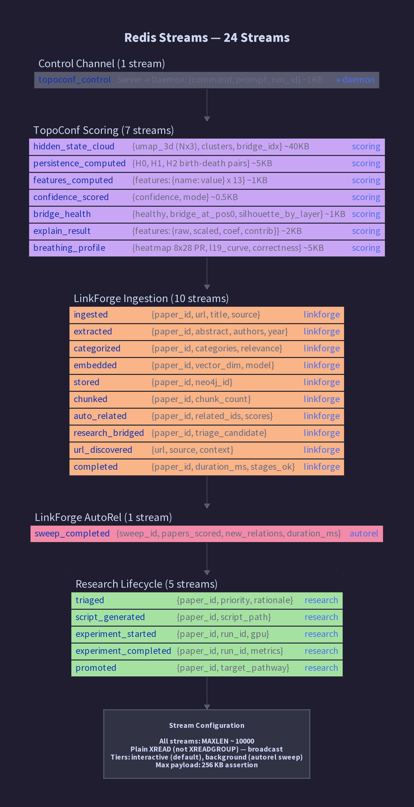

### Control Channel (Server → Daemon)

| Stream | Payload | Size |
|--------|---------|------|
| `topoconf:control` | `{command, prompt, run_id}` | ~1 KB |

### Scoring Streams (Daemon → Server)

| Stream | Payload | Size |
|--------|---------|------|
| `topoconf:scoring:hidden_state_cloud` | `{umap_3d (N x 3), clusters, bridge_idx}` | ~40 KB |
| `topoconf:scoring:persistence_computed` | `{H0, H1, H2 birth-death pairs}` | ~5 KB |
| `topoconf:scoring:features_computed` | `{features: {name: value} x 13}` | ~1 KB |
| `topoconf:scoring:confidence_scored` | `{confidence, mode}` | ~0.5 KB |
| `topoconf:scoring:bridge_health` | `{healthy, bridge_at_pos0, silhouette_by_layer}` | ~1 KB |
| `topoconf:scoring:explain_result` | `{features: {raw, scaled, coef, contrib}, top_contributor}` | ~2 KB |

All streams: `MAXLEN ~ 10000`, plain `XREAD` (not `XREADGROUP`) for broadcast semantics, max 256 KB payload assertion.

---

## Project Structure

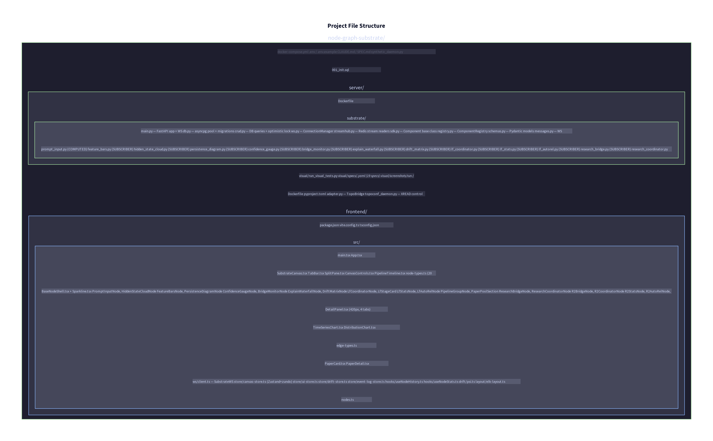

```
node-graph-substrate/
├── docker-compose.yml
├── migrations/
│   ├── 001_init.sql
│   └── 002_schema_fixes.sql
├── server/substrate/
│   ├── main.py            # FastAPI app, HTTP routes, WS handler
│   ├── db.py              # asyncpg pool + migration runner
│   ├── crud.py            # DB queries + optimistic locking
│   ├── ws.py              # ConnectionManager (per-socket lock)
│   ├── streamhub.py       # Redis stream reader tasks + fan-out
│   ├── sdk.py             # Component base class + Socket/NodeKind
│   ├── registry.py        # ComponentRegistry singleton
│   ├── schemas.py         # Pydantic HTTP models
│   ├── messages.py        # WS message discriminated unions
│   └── components/        # 7 registered components
├── frontend/src/
│   ├── App.tsx             # Init + WS lifecycle + event handling
│   ├── lib/ws/client.ts    # SubstrateWS (backoff + RAF coalescing)
│   ├── lib/store/          # Zustand stores (canvas + UI)
│   ├── lib/nodes/          # Registry + handle colors
│   ├── types/              # Node + message TypeScript types
│   └── components/
│       ├── canvas/         # SubstrateCanvas + Controls + node-types
│       ├── nodes/          # 7 node components + BaseNodeShell
│       └── sidebar/        # NodePalette
├── daemons/topoconf/
│   ├── adapter.py          # TopoBridge (7-stage pipeline)
│   └── topoconf_daemon.py  # XREAD control loop
└── synthetic_daemon.py     # Fake stream data for testing
```

---

## WebSocket Lifecycle

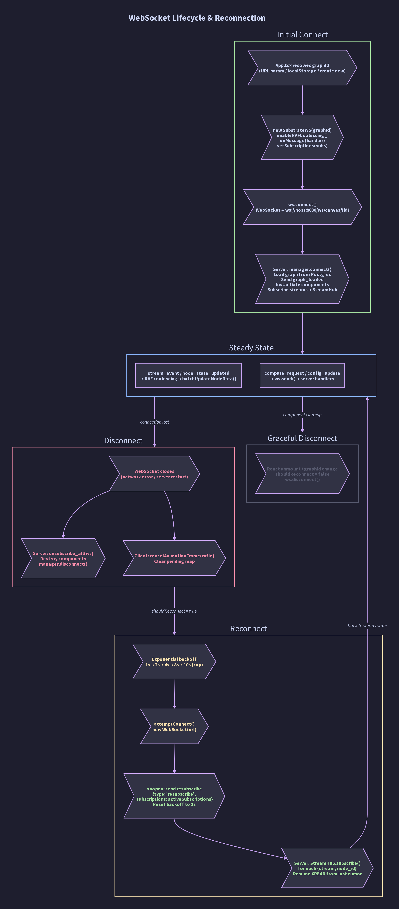

### Connection Flow
1. `App.tsx` resolves `graphId` → creates `SubstrateWS(graphId)`
2. Enables RAF coalescing, registers message handler, sets subscriptions
3. `ws.connect()` opens WebSocket to `/ws/canvas/{graphId}`
4. Server loads graph, sends `graph_loaded`, instantiates components, subscribes streams

### Reconnection
- Exponential backoff: 1s → 2s → 4s → 8s → 10s cap
- On reconnect: automatically sends `resubscribe` with all active subscriptions
- Server re-registers streams in StreamHub, resumes XREAD from last cursor
- Backoff resets to 1s on successful reconnect

### Cleanup
- Component unmount: `shouldReconnect = false`, `cancelAnimationFrame`, clear pending map
- Server side: `unsubscribe_all(ws)`, destroy components, remove from ConnectionManager

---

## Key Design Decisions

- **Substrate isolation**: Server never imports topo-confidence. `grep -r "topo_confidence" server/substrate/` = 0 lines.
- **Broadcast semantics**: Plain `XREAD` (not consumer groups) — every connected client sees every event.
- **RAF coalescing**: Multiple stream events within a single frame are merged before hitting React state.
- **Per-node subscriptions**: `useNodesData(id)` instead of `useNodes()` — only the affected node re-renders.
- **Optimistic concurrency**: `expected_version` on save prevents silent overwrites. 409 triggers full re-sync.
- **Server-side ID tracking**: Client tracks `_serverNodeIds`/`_serverEdgeIds` to compute remove ops on save.
- **R3F `frameloop="demand"`**: 3D point cloud only re-renders when data changes, not every animation frame.

---

## Development

```bash
# TypeScript check
cd frontend && npx tsc --noEmit

# Server logs
docker compose logs -f server

# Redis stream inspection
redis-cli -p 6381 XLEN topoconf:scoring:features_computed
redis-cli -p 6381 XRANGE topoconf:scoring:features_computed - + COUNT 1

# Substrate isolation check
grep -r "topo_confidence\|TopoConfidence" server/substrate/
```

---

## Screenshots

### Full Canvas — Empty State

All 7 nodes pre-wired on first visit. Node Palette sidebar on the left with 4 categories (Input, Extraction, Topology, Scoring). Save/Load controls top-right.

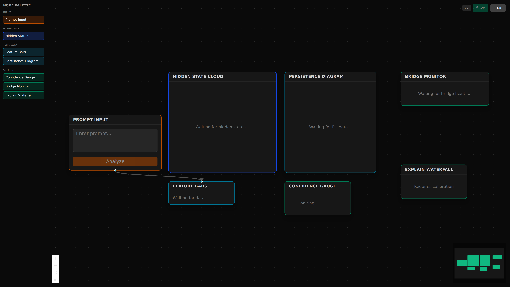

### Live Streaming Data

Synthetic daemon publishing to 6 Redis Streams every 2s. All subscriber nodes update in real-time via WebSocket + RAF coalescing.

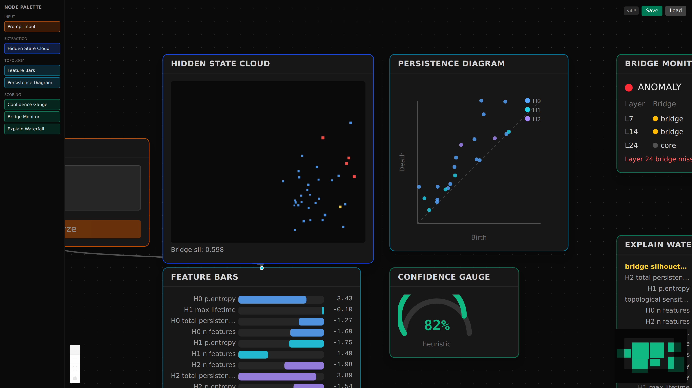

### Compute Path — Prompt Analysis

User enters a prompt and clicks "Analyze". The compute request flows through WebSocket, all nodes update with new topological features.

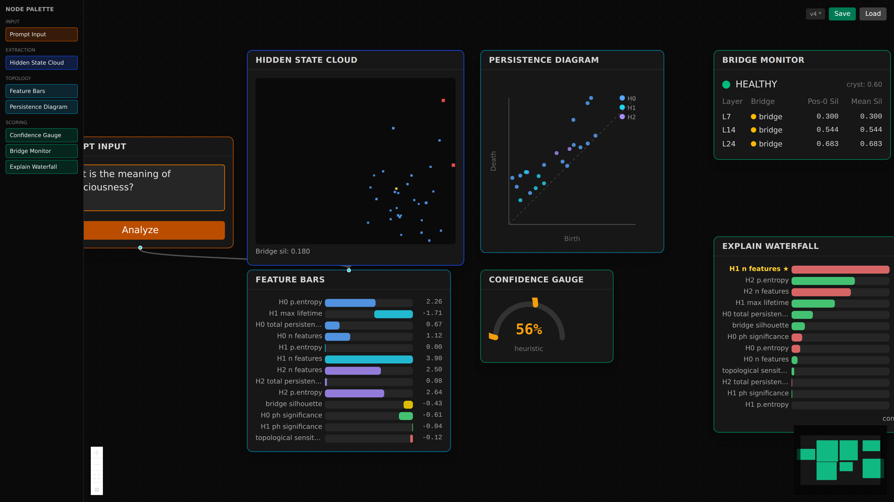

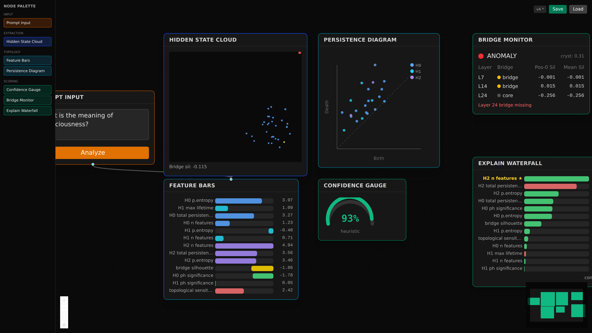

### Individual Nodes (with live data)

<table>
<tr>
<td width="50%">

**Hidden State Cloud** — R3F 3D point cloud of token embeddings. Blue = cluster 0, red = cluster 1, gold = bridge token. Bridge silhouette score shown below.

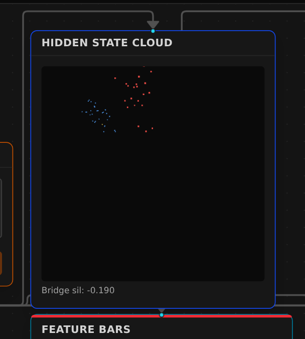

</td>
<td width="50%">

**Persistence Diagram** — Birth-death scatter for homology dimensions H0 (blue), H1 (cyan), H2 (purple). Points above the diagonal indicate persistent topological features.

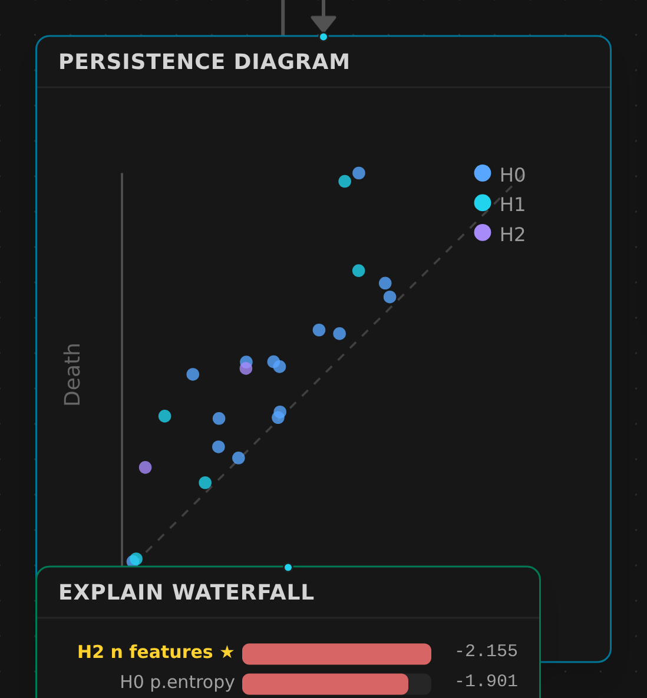

</td>
</tr>
<tr>
<td>

**Feature Bars** — 13 topological features color-coded by dimension group (blue = H0, cyan = H1, purple = H2, gold = bridge, green/red = significance).

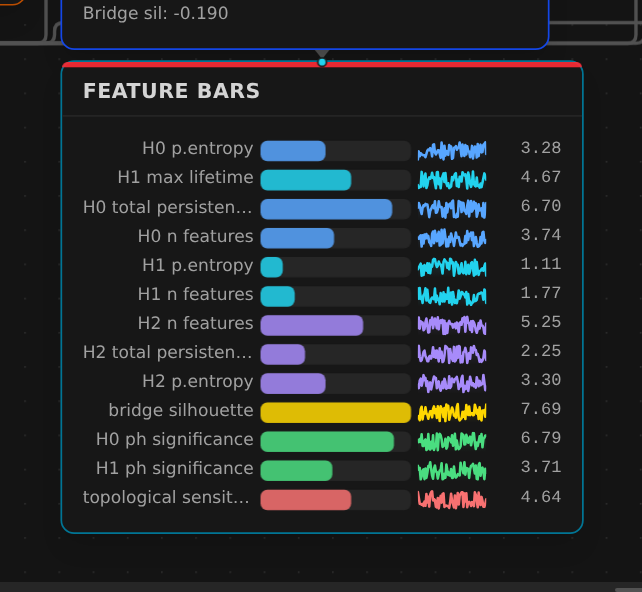

</td>
<td>

**Confidence Gauge** — SVG arc gauge showing heuristic or calibrated confidence score. Green ≥ 0.7, yellow ≥ 0.4, red < 0.4.

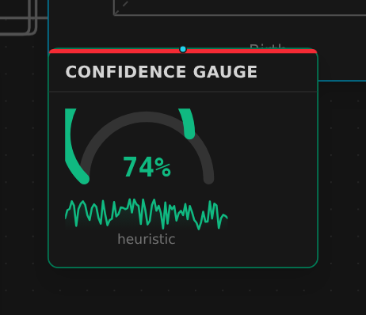

</td>
</tr>
<tr>
<td>

**Bridge Monitor** — Layer-by-layer bridge detection (L7/L14/L24) with health status and silhouette scores. Anomaly = bridge missing at any layer.

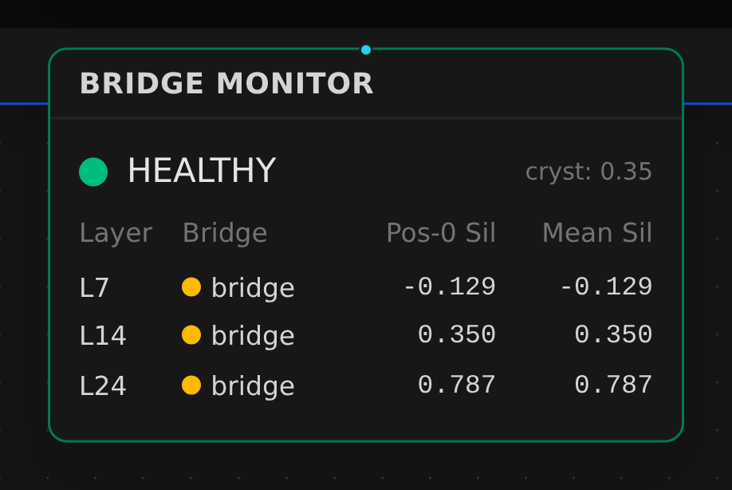

</td>
<td>

**Explain Waterfall** — Feature contribution waterfall showing which topological features drive the confidence score. Top contributor highlighted.

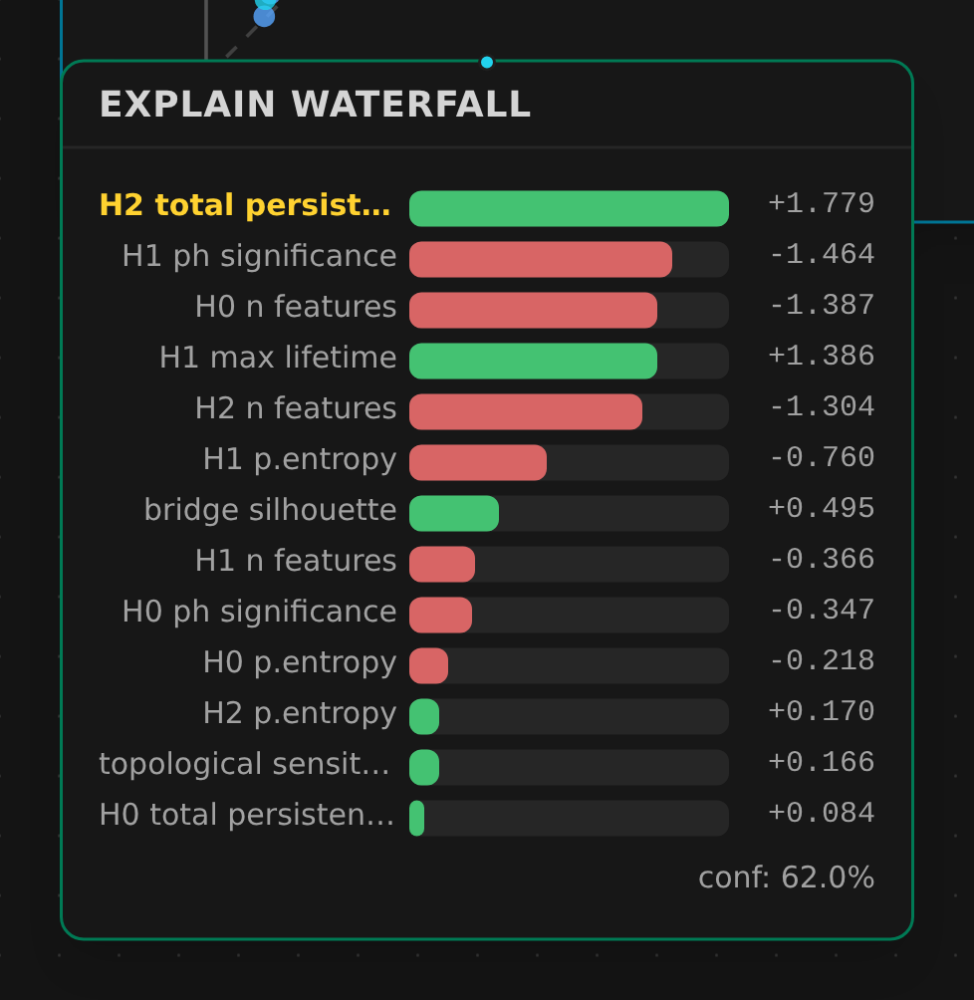

</td>
</tr>
</table>

### Empty Nodes (waiting for data)

Individual node close-ups before data arrives — each shows its placeholder state.

<table>
<tr>
<td width="33%">

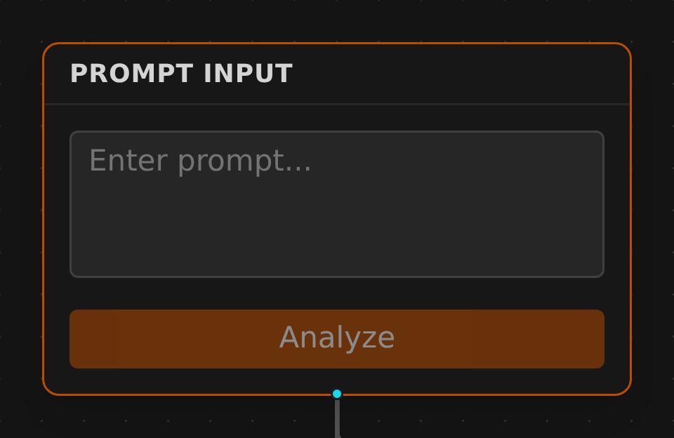

</td>
<td width="33%">

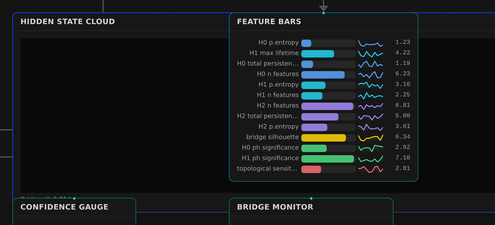

</td>
<td width="33%">


</td>
</tr>
<tr>
<td>

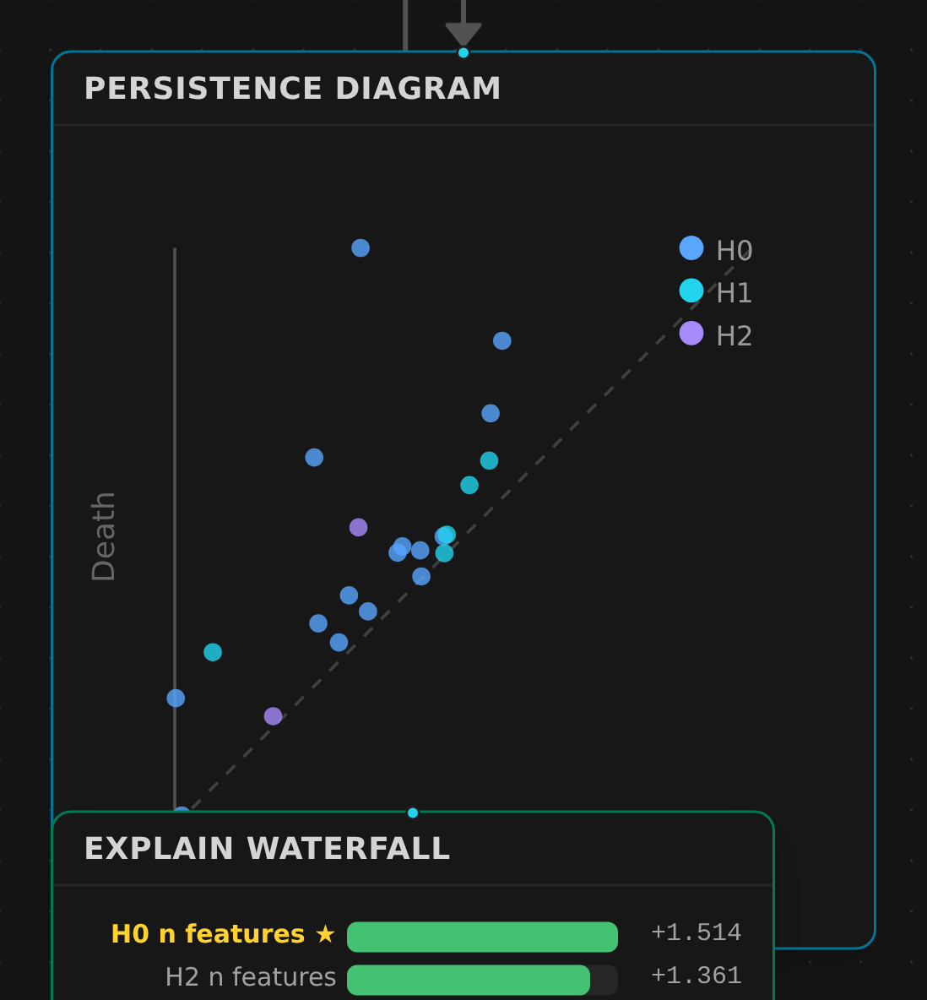

</td>
<td>

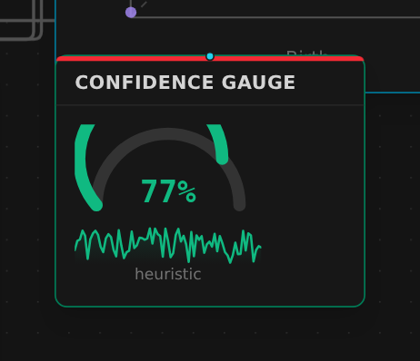

</td>
<td>

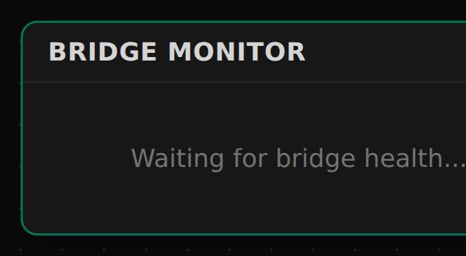

</td>
</tr>
</table>
