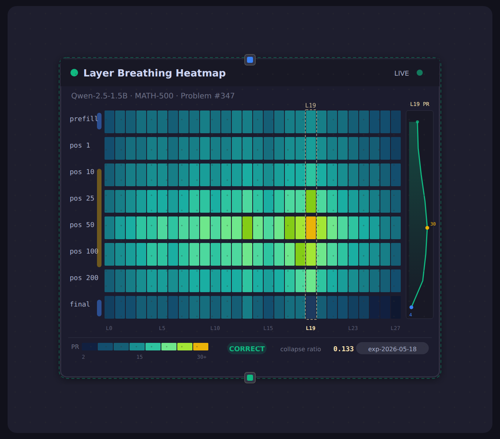

# node-graph-substrate

**A React Flow canvas that makes [`~/topo-confidence`](https://github.com/musicofhel) observable in real time.**
FastAPI + Redis Streams + PostgreSQL stream live data onto a node graph: ~30 node types across four pack-defined
canvases subscribe to 24 Redis streams and update as each pipeline stage completes — with resizable nodes,
time-series detail panels, drift detection, and a visual test suite.

> The substrate server **never imports topo-confidence**. All coupling is via Redis Streams; the
> topo-confidence adapter runs in a separate daemon container.

📐 **[Interactive architecture diagrams →](https://musicofhel.github.io/node-graph-substrate/architecture.html)**
 (tabbed viewer — one diagram per tab) · 📖 **[Full architecture reference → ARCHITECTURE.md](ARCHITECTURE.md)**


---

## How it works — three loops

Everything is one of three loops. The [diagram viewer](docs/architecture.html) walks through each visually.

| Loop | Transport | What happens |
|------|-----------|--------------|
| **Graph CRUD** | HTTP → PostgreSQL | Save diffs node/edge ops and `PATCH`es with `expected_version` (optimistic locking) |
| **Compute** | WebSocket | `compute_request` → `component.build()` → `computation_result` fans features to subscribers |
| **Subscriber** | Redis Streams → WebSocket | `XADD` → StreamHub `XREAD` → `stream_event` → 500 ms throttled flush → per-node re-render |

| Service | Port | Stack | Runtime |
|---------|------|-------|---------|
| **Frontend** | 5173 | Vite 6 · React 19 · React Flow v12 · Zustand · R3F | Native (WSL2) |
| **Server** | 8080 | FastAPI · uvicorn · asyncpg · redis-py | Docker |
| **PostgreSQL** | 5434 | postgres:16-alpine | Docker |
| **Redis** | 6381 | redis:7-alpine | Docker |
| **TopoConf daemon** | — | topo-confidence wrapper (`--profile topoconf`) | Docker (opt-in, GPU) |

---

## Quick start

```bash
# PREFERRED — unified script starts NGS alongside link-forge + research-graph + autopilot:
bash ~/start-research-pipeline.sh
bash ~/start-research-pipeline.sh --status        # what's running

# MANUAL — NGS only:
docker compose up                                 # postgres, redis, fastapi
cd frontend && npm run dev                        # vite (native — not in Docker on WSL2)

# Synthetic data, no GPU (real pre-computed MATH-500 breathing data):
python scripts/synthetic_daemon.py --math500-cache data/math500_breathing_cache.json
python scripts/synthetic_linkforge.py             # linkforge ingestion streams

# Real topo-confidence scoring (needs GPU + model cache):
docker compose --profile topoconf up
```

Open <http://localhost:5173>. Each canvas seeds its nodes on first visit.

---

## Canvases

The app is **pack-based** — each pack contributes node types, streams, and *canvas kinds*:

| Canvas | Pack | Streams | Shows |
|--------|------|---------|-------|
| **Scoring** | topo-confidence | `topoconf:scoring:*` (7) | Per-prompt topology: features, persistence, 3D hidden-state cloud, confidence, bridge health, breathing heatmap |
| **Research Bridge** | link-forge | `topoconf:research:*` (5) + autorel | Triage → experiment → promote lifecycle + cross-pipeline bridge |
| **Ingestion** | link-forge | `linkforge:*` (10) | Paper digestion waterfall, stage-by-stage |
| **Experiments** | experiments | REST | Experiment cloud, algorithm selector, ROI, findings |

See **[ARCHITECTURE.md](ARCHITECTURE.md)** for the full node registry, the 18 backend components, the
24-stream inventory, the DB schema, and the WebSocket protocol.

---

## MATH-500 breathing pipeline

The flagship Scoring node. **Layer Breathing Heatmap** visualizes the *dimensional breathing pattern* — how
the Participation Ratio of hidden states evolves across all 28 Qwen-2.5 layers during chain-of-thought, with
**L19** highlighted as the signal layer where breathing is strongest. A sidebar sparkline tracks the L19 curve;
the footer shows the correctness outcome and collapse ratio (final/peak PR).

This runs on **real pre-computed data**, no GPU at demo time:

```bash
# One-time pre-compute (~5 min) from real Qwen hidden states:
OMP_NUM_THREADS=1 MKL_NUM_THREADS=1 OPENBLAS_NUM_THREADS=1 \
  python scripts/precompute_breathing_cache.py
# → data/math500_breathing_cache.json + frontend/public/math500_prompts.json (both gitignored)
```

`PromptInputNode` pre-loads 500 MATH problems (◄/► to browse, demo mode auto-cycles); the daemon serves the
matching real heatmap over `topoconf:scoring:breathing_profile`.



---

## Architecture diagrams

The full set lives in the **[tabbed viewer](docs/architecture.html)**
([published online](https://musicofhel.github.io/node-graph-substrate/architecture.html)). For quick reference
on GitHub, each is collapsed below:

<details>
<summary><b>System architecture</b> — containers & isolation</summary>


</details>

<details>
<summary><b>Database schema</b> — 6 tables, cascade deletes</summary>


</details>

<details>
<summary><b>WebSocket protocol</b> — single endpoint, discriminated unions</summary>


</details>

<details>
<summary><b>Data flow — compute path</b></summary>


</details>

<details>
<summary><b>Data flow — subscriber path</b> (Redis → WS → node)</summary>


</details>

<details>
<summary><b>Frontend component tree</b></summary>


</details>

<details>
<summary><b>State management</b> — four Zustand stores</summary>


</details>

<details>
<summary><b>Node registry</b> — packs → canvases</summary>


</details>

<details>
<summary><b>Backend component SDK</b></summary>


</details>

<details>
<summary><b>Graph CRUD lifecycle</b> — optimistic locking</summary>


</details>

<details>
<summary><b>Redis streams</b> — 24-stream inventory</summary>


</details>

<details>
<summary><b>Project structure</b></summary>


</details>

<details>
<summary><b>WebSocket lifecycle</b> — backoff & resume</summary>


</details>

> Diagrams are authored in [D2](https://d2lang.com) (`docs/diagrams/*.d2`) and rendered with
> `docs/diagrams/render-all.sh`. Edit the `.d2`, re-render, and both the viewer and these images update.

---

## Development

```bash
cd frontend && npx tsc --noEmit                   # TypeScript check
docker compose logs -f server                     # server logs
grep -rn "topo_confidence" server/substrate/      # isolation check — must be 0

# Redis stream inspection
redis-cli -p 6381 XLEN topoconf:scoring:features_computed
redis-cli -p 6381 XRANGE topoconf:scoring:breathing_profile - + COUNT 1

# Visual test suite (19 Playwright specs across all canvases)
python tests/visual/run_visual_tests.py
python tests/visual/run_visual_tests.py --spec confidence_gauge --no-headless
python scripts/take_screenshots.py                # screenshot gallery
```

---

## Screenshots

<table>
<tr>
<td width="50%">

**Scoring canvas** — all nodes pre-wired on first visit; synthetic daemon publishes to the scoring streams,
subscriber nodes update live via WebSocket + throttled flushing.


</td>
<td width="50%">

**Ingestion canvas** — the [link-forge](https://github.com/musicofhel/link-forge) paper pipeline rendered as
a live waterfall (Ingested → … → Completed).


</td>
</tr>
<tr>
<td>

**Hidden State Cloud** — R3F 3D point cloud of token embeddings (blue/red clusters, gold bridge token).


</td>
<td>

**Persistence Diagram** — birth–death scatter for H0/H1/H2; points off the diagonal are persistent features.


</td>
</tr>
<tr>
<td>

**Paper Pool** — cards with forge-score bars, category badges, processing time; sort/filter/search.


</td>
<td>

**Detail Panel** — 420 px sidebar, 4 tabs (Overview · Series · Config · Drift). Drift = Population Stability
Index vs. baseline.


</td>
</tr>
</table>

---

## More

- **[ARCHITECTURE.md](ARCHITECTURE.md)** — full reference (nodes, components, streams, schema, lifecycles, design decisions)
- **[CLAUDE.md](CLAUDE.md)** — agent quick reference (ports, build order, MATH-500 details, topo-confidence API notes)
- **[SPEC-v5.md](SPEC-v5.md)** — canonical spec · **[docs/history/](docs/history/)** — archived specs & migrations
